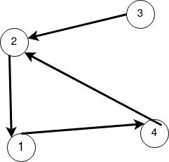

## Матрица смежности. Связность

Человечество придумало чертову кучу матриц для графов, но самая очевидная та, на которой мы закончили [введение](intro.md) --- это матрица смежности `A`.

У нее размер `|V|x|V|` и элемент `A[i,j]` равен единице, если есть дуга из i-й вершины в j-ю, а иначе -- ноль. Все просто. Можно, конечно, ее по-другому задать, и у нее будут иные интересные свойства, но это будет потом. А пока будем довольствоваться такой простой, квадратненькой и замечательной матрицой.

Что б нам с ней такого сделать?... А давайте транспонируем и сравним с самой собой:

`trans(A) == A`

Если условие истинно, то у каждой дуги в графе есть обратная. А значит, можно считать, что граф неориентирован.

А давайте теперь попробуем узнать, из скольки кусков -- компонент связности --- состоит наш граф. Связность бывает в неориентированном и ориентированном (сильная) смысле. Начнем с неориентированной... Но стоп-стоп, у нас же ориентированный граф!?! Пф...!

`A := A + trans(A)` 

И поехали дальше.
Но теперь в матрице, кроме единиц и нулей, могут быть двойки. Ерунда! Давайте возьмем в качестве сложения операцию логический `or`.

Введем на множестве вершин графа набор бинарных отношений `D(n)` -- пара вершин, достижима друг из друга за ровно `n` шагов. Напоминаем: бинарные отношения задают бинарные матрицы

Что такое `D(0)`? Пары вершин, достижимых друг из друга, за ноль шагов -- это пары одинаковых вершин. Так что это единичная матрица. 

`D(0) = I`

Что такое `D(1)`? Пары вершин, достижимых ровно за один шаг. Ну это матрица `A`.

А `D(2)`? Это композиция отношений `D(1)` и `D(1)`! Действительно:
Чтобы из вершины `x` достичь `y` ровно за два шага. Нужно, чтобы существовала вершина `z`, достижимая из `x` за один шаг, из которой достижим `y` тоже за один шаг. То есть `(x,y) in D(2)  <=>  (x,z) in D(1) and (z, y) in D(1)`. Именно так композиция бинарных отношений и определяется. Осталось всмомнить, что квантору существования соответсвует операция `or`, чтобы понять, что нам всего навсего надо применить матричное умножение. Причем в качестве сложения для элементов матрицы используем `or`, а в качестве умножения -- `and`.

`D(2) = D(1) * D(1) = A * A = A^2`

И соответственно `D(n) = A^n`. Кстати, `D(0)` тут также отлично выражается как нулевая степень.

Введем теперь отношение `R`, связывающее две вершины, в принципе достиживые друг из друга за сколько-нибудь шагов. Очевидно, что

`R = sum(D(i) for i in [0, +inf))`

Потому что "за сколько-нибудь" -- 'это или за 0, или за 1, или за 2, или.... 

Как только посчитать эту бесконечную сумму? Да очень просто: она конечная.
Если мы за `|V|` шагов от одной вершины до другой никак дойти не смогли, то и за `|V|+1` не дойдем. Максимальная длина простого пути -- `|V|` вершин. Дальше вершины должны начать повторяться просто по принципу Дирихле.

Сумма получилась конечная. Отлично. Да вот только суммировать тут особо ничего не нужно. Нужно лишь заметить, что для так введенных операций сложения и матричного умножения справедливо:
`sum(A^i for i in [0, N]) == (I + A)^N`

Так что `R = (I + A)^|V|`

Осталось показать (покажите!), что `R` вообще-то не абы какая ерунда, а самое настоящее отношение эквивалентности на множестве вершин графа. И вообще называется транзитивным замыканием!
А по любому отношению эквивалентности на множестве можно провести факторизацию это множества... ух! Короче: вот сколько элементов в фактор-множестве `V/R` столько и компонент связности.

Факторизация с помощью матрицы отношения эквивалентности делается очень просто:
- Берем любой элемент матрицы, равный единице. 
- Рассматриваем строку, в которой он стоит -- выписываем номера столбцов, где в этой строке стоят единицы. 
- Получили первый класс эквивалентности. 
- Вычеркиваем из матрицы все строки и столбцы с этими выписаными номерами.
- Повторить, пока матрица не закончится

-----
Нериентированный случай разобрали. А что с ориентированным? Тут у нас сильная связность: две вершины лежат в одной компоненте сильной связности, если из одной можно перейти в другую и обратно с учетом ориентации дуг. 

Вот пример

Тут все вершины находятся в одной компоненте (просто) связности. Но не в одной компоненте сильной связности: в тройку нельзя вернуться.
А из 1, 2, 4 можно ходить друг в друга и обратно.

Невероятно, но факт: компоненты сильной связности можно построить почти точно так же, как и компоненты простой связности.

Берем исходную матрицу `A`. Не транспонируем, ничего не складываем, оставляем как есть. Нам важна ориентация дуг.

Берем `R = (A + I)^|V|`

Получили транзитивное замыкание. Но в ориентированном случае не совсем отношение эквивалентности. В нем есть "посторонние" не симметричные переходы. Это переходы из одних компонент в другие. Что же делать? Возьмем их и убьем!

`R := R and trans(R)`

Здесь `and` поэлементный. 

Все. Полученный `R` -- отношение эквивалентности. Мы восхитительны.

-----------------------
Прежде чем посыпятся дельные замечания о том, что описанный подход крайне неэффективен, красив только в теории и такие задачи надо решать православными обходами в ширину/глубину,
учтите, что для выполнения всех описанных действий достаточно побитовых операций и для маленьких графов (32-128 вершин) это может быть намного эффективнее. Особенно на FPGA.  

