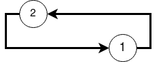
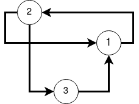
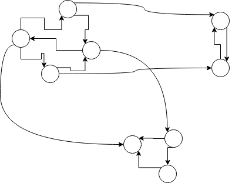
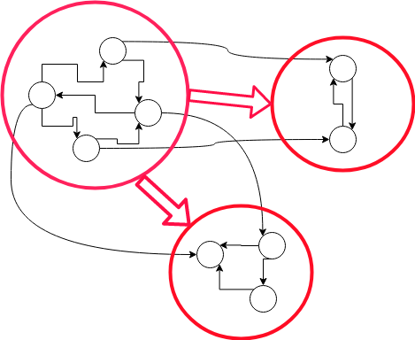
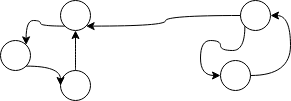
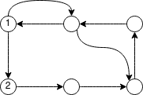

## Матрица смежности. Регулярность

Как-то лихо мы бесконечную сумму
`I + A + A^2 + ... A^n + ...` конечной заменили.
Корректно, конечно, но лихо. Да, вершины в путях обязаны начать повторяться.
Но ведь совсем не обязательно, что `A^|V| = A^(|V|+1)`

Действительно, вот граф с двумя вершинами:



Его матрица 
```
A = [
      [ 0, 1 ]
      [ 1, 0 ]
    ]
```

Легко видеть, что 
- `A^2 = I`
- `A^3 = A`
- `A^4 = I`
- ...

Она повторяется с периодом 2.

А если мы добавим третью вершину



```
A = [
      [ 0, 1, 0]
      [ 1, 0, 1]
      [ 1, 0, 0]
    ]
```
Можно убедиться, что все матрицы после шестой степени будут одинаковыми. И более того -- полностью состоять из одних единиц!

Иногда ориентированные графы, матрицы смежности которых обладают подобным свойством: все степени, начиная с некоторой, совпадают -- называют регулярными. И их матрицы тоже называют регулярными. Хотя в привычном матричном смысле (определитель отличен от нуля) они совершенно не обязаны быть регулярными (матрица из всех единиц "регулярна", но имеет нулевой определитель).

Возникает вопрос, а каков критерий такой регулярности? И что вообще дает эта регулярность нам?

Дает регулярность очень многое. Но мы этого, пока играемся с простейшим случаем графов без весов, не заметим. Если же перейти к взвешенным графам (каждой дуге сопоставлено число) и интерпретировать вес как вероятность перехода по дуге, то у регулярных графов будет наблюдаться замечательное свойство: откуда бы мы ни начинали случайно блуждать, через довольно длительное время мы будем оказываться в одних и тех же вершинах с одной и той же вероятностью (фиксированной для вершины). Но это будет потом.

### Критерий регулярности

Для начала давайте ограничимся только связными графами. Потому что несвязные можно рассматривать как отдельные независимые графы, а потом результаты для каждого объединить, учитывая независимость.

И сразу пойдем еще дальше: будем рассматривать только сильно связные графы!
Потому что другие рассматривать не интересно.

Действительно, возьмем наше транзитивное замыкание `R`, из которого мы пролучали отношение эквивалентности (`R and trans(R)`), факторизуем по нему множество вершин -- построим фактор-граф (его еще называют конденсацией)! Вершины этого фактор-графа будет соответсвовать компонентам сильной связности. А дуги -- переходам из компоненты в компоненту (они определяются как раз теми элементами матрицы `R`, которые мы убили, сделав поэлементный `and` с `trans(R)`).

Ну то есть, вот граф:



А вот фактор-граф (конденсация):



Легко показать, что конденсация по компонентам сильной связности никогда не содержит **контуров** (а циклы -- может!)

Матрица смежности любого бесконтурного графа ялвяется нильпотентной. Причем даже относительно обычного сложения и умножения. То есть в какой-то степени обращается в нулевую матрицу. Можно показать, что эта "какая-то" степень -- не более чем `|V|` (привет принципу Дирихле!)
Так что имеет место замечательный критерий:

`A^|V| = 0` тогда и только тогда, когда в графе нет **контуров**. Так что вот еще один критерий топологической сортируемости графа для тех, кто не любит обход в глубину.

Что же означает эта нильпотентность? А то, что все, что происходит в компоненте сильной связности, не особо имеет смысл рассматривать, если из этой компоненты есть выход. Там могут быть циклические повторения, но они никак не связаны с другими компонентами. Так что рассматривать их можно отдельно от других. Или не рассматривать вовсе. На периодические процессы в других компонентах они не влияют. А в случае, когда на переходах написаны вероятности, это также означает, что рано или поздно мы из этой компоненты выйдем и больше никогда в нее не вернемся. Потому такую компоненту и вершины в ней иногда называют невозвратными.

Так что приходим к тому, что остается рассмотреть граф, состоящий ровно из одной компоненты сильной связности.

И тут возникает долгожданный критерий регулярности:

*Матрица смежности `A` сильносвязного графа регулярна тогда и только тогда, когда наибольший общий делитель длин всех возможных **контуров** графа равен единице. Что то же самое, что в графе существуют два взаимнопростых **контура**. Более того: период повторения степеней матрицы `A` в точности равен НОД'у длин контуров*

Сильносвязность здесь существенна (не просто так мы к одной компоненте шли!).
Вот граф с двумя взаимнопростыми контурами (длины 2 и 3)



Но его матрица смежности никак не будет регулярной -- будет циклически повторяться. С периодом 6 ( наименьшее общее кратное(2,3) )

Доказательство этого замечательного критерия можно провести многими способами.
Например, грубо, так:
- Рассмотрим любой контур длины `L`
- Он проходит через некоторую последовательность простых (внутри каждого дуги не повторяются) контуров с длинами `l1, l2, l3....`
- Через каждый из этих контуров он обязательно проходит целое число раз (ну очевидно, как же иначе). В принципе, можно считать, что этот большой контур проходит через вообще все простые конруры (просто через некоторые по 0 раз)
- И вообще, контуры образуют линейное пространство, но об этом мы как-нибудь потом...
- Значит, длина этого большой контура: `L = n1*l1 + n2*l2 + ...`
- Дальше уже понятно. Тут явно маячит линейное представление наибольшего общего делителя и все дела. Минимальное положительное `L`, порождаемое всеми возможными наборами чисел, и есть наибольший общий делитель длин всех простых контуров, а значит и всех контуров вообще.
- И ежику колючему понятно, что, раз у всех циклов длина кратна `L`, то период повторения как минимум равен `L` или кратен ему. Осталось показать, что он точно равен `L`.
- Для каждой пары вершин `(x,y)` рассмотрим длины всех возможных путей между ними. Можно показать, что все они дают один и тот же остаток от деления на `L`  (рассмотрите два любых пути между `x` и `y` и любой цикл, проходящий через `x` и `y`). Обозначим этот остаток как `r(x,y)`
- Введем хитрое отношение `C` на множестве вершин: `x` и `y` связаны отношением `C`, если `r(x,y) = 0`. Внезапно, это отношение эквивалентности!
- Строим по нему фактор-граф. Внезапно, в нем будет ровно `L` вершин и `L` дуг! И он представляет собой всего навсего один цикл (докажите! это не сложно, но надо с остатками повозиться).
- И понятно, что матрица этого фактор-графа будет повторяться с периодом `L`
- Но как это связано с периодом матрицы исходного графа? Да очень просто: мы построили такое разбиение множества вершин, что, если взять любой набор стартовых вершин (битовый вектор `p`), сгруппировать их по этому разбиению, то вершины будут переходить из одного класса в другой не смешиваясь. И, начиная с некоторого `q = p * A^N`,
при последующих умножениях `q` на `A` его компоненты будут прыгать из одного класса (называемого циклическим) в другой. С периодом не больше чем `L`. А значит и какая-то степень матрицы `A` будет повторяться с тем же периодом.
- Получили, что период не больше `L`, но и не меньше. Значит в точности `L`

Ух, кошмар какой. А можно проще? Можно, наверное. Но самое интересное в том, что 
Матрица смежности `A` регулярна тогда и только тогда, когда существует `N`, такое что `A^N` полностью состоит из единиц.

А почему нельзя взять какое-то конкретное `N`? Ведь очень заманчиво взять вместо него `|V|` и радоваться. Но, увы, нет. 

`A^N` -- задает отношение: из одной вершины можно попасть в другую **ровно** за `N` шагов.

Но вот граф, регулярный (есть циклы длины 2 и 3)



Но из вершины 1 невозможно попасть в вершину 2 ровно за шесть переходов.
Любой путь из 1 в 2 содержит `1 + 2k + 6r + 3m` переходов, причем `m` может быть больше нуля, только если `r > 0` (нельзя начать ходить по контуру длины 3, не пройдя по контуру длины 6). Что сразу дает минимум 7 переходов. Такие дела. 


-------
Все вышеописаные построения осуществляются почти в таком же виде, например, в теории Марковских цепей. Цепь задается взвешенным графом (+ начальное распределение), где веса -- вероятности переходов. И все строится из конструкций, предполагающих, что где-то как-то на N-м шаге будет ненулевая вероятность. Но вот оказывается, что значения вероятностей, записанные на дугах, роли не играют. Они только влияют на точные значения вероятностей в предельных распределениях. А динамика, периодические колебания, возвратность тех или иных состояний зависят только от топологии графа. И, как видно, их можно рассчитывать на одних только битовых операциях!
