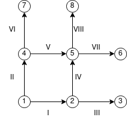
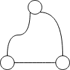

## Матрица инцидентности. Лапласиан и остовные деревья.

Мы долго крутили матрицу смежности, но на ней свет клином не сошелся. Есть и другие матрицы.

Граф задается множеством дуг/ребер и множеством вершин. Каждое ребро/дуга связаны с двумя (или одной, если это петля) вершинами. Мы можем описать эту связь с помощью бинарного отношения, заданного на множестве пар: (ребро, вершина). То есть, если занумеровать и вершины, и ребра, отношение задается матрицей, назовем ее `B`, размера `|E|x|V|`, в которой элемент `B[i][j]` равен 1, если `i`-e ребро связано (инцидентно!) с `j`-й вершиной. Эта матрица полностью описывает граф, поддерживает кратные дуги и петли и вообще она замечательная. Имя ей -- матрица инцидентности.

В случае неориентированного графа все ровно так, как было сказано выше. В случае ориентированного, чтобы отразить ориентацию дуг, задают эту матрицу слегка по-другому:

```
B[i][j] ==  1 // если j -- конец дуги i
B[i][j] == -1 // если j -- начало дуги i
B[i][j] == 0 // если дуга i никак не связана с вершиной j
```
Для петель оставляют только одну единицу.

Давайте пример:



Вот такой замечательный граф, в котором 8 вершин и 8 дуг.

Его матрица инцидентности:

```
B = [
 [ -1,  1, 0,  0,  0, 0, 0, 0 ],
 [ -1,  0, 0,  1,  0, 0, 0, 0 ],
 [  0, -1, 1,  0,  0, 0, 0, 0 ],
 [  0, -1, 0,  0,  1, 0, 0, 0 ],
 [  0,  0, 0, -1,  1, 0, 0, 0 ],
 [  0,  0, 0, -1,  0, 0, 1, 0 ],
 [  0,  0, 0,  0, -1, 1, 0, 0 ],
 [  0,  0, 0,  0, -1, 0, 0, 1 ],
]
```
И всего-то... Но мы ж не просто так именно такой граф для примера взяли, да? Кинем его на декартову систему координат, чтоб вершины в целочисленных точках оказались, а между соседними вершинами расстояние было единичным. Возьмем какую-нибудь функцию `F` двух переменных. Посчитаем ее значения в вершинах этого графа -- получим вектор `f` из восьми чисел. А теперь умножаем на него нашу матрицу `B`:

`g = B*f`

Получили еще какие-то 8 числел и что? А вот что: чем эти числа относительно функции `F` являются? 
Это разности значений функции `F` между соседними узлами. Осталось только поделить на расстояние между двумя соседними узлами и устремить это расстояние к нулю (мы ж можем как угодно наш граф на декартовы координаты накинуть). Мы получили частные производные! (они же производные по направлению). Таким образом, мы для каждой вершины графа можем посчитать приближение к производной по каждому из направлений вхождения в эту вершину.
А знаете, что это значит?... Что матрица `B` --- дискретный аналог [оператора Гамильтона](https://ru.wikipedia.org/wiki/Оператор_набла) для графов!

И если `B*f` -- это градиент, посчитанный сразу в каждой вершине, тогда, по аналогии с непрерывным оператором Гамильтона, скалярный квадрат матрицы `B` -- оператор Лапласа. Записывается он как `L = transp(B) * B` -- а это уже матрица размера `|V|x|V|`

Что у нас тут происходит в `transp(B) * B`? Мы перемножаем столбцы матрицы `B` друг с другом.
Столбец `B[.][i]` говорит нам, какие дуги входят в вершину `i`, а какие из нее выходят.

Что будет, если скалярно умножить столбец сам на себя? `dot(B[.][i], B[.][i]) = ?` Каждая -1 умножется на -1, каждая 1 умножится на 1. Потомы это все суммируется. Получится просто общее количество ненулевых элементов в столбце. То есть количество инцидентных `i`-й вершине дуг. Это количество называется степенью вершины -- `deg(i)`. То есть `dot(B[.][i], B[.][i]) = deg(i)`.

А если мы будем перемножать разные столбцы? Если немножко порисовать и подумать, будет ясно, что `dot(B[.][i], B[.][j])` равен количеству дуг, соединяющих i-ю вершину и j-й. Причем это количество надо взять с минусом: при вычислении скалярного произведения будут перемножаться концы одной и той же дуги и суммироваться: -1 будет умножаться на 1. Все слагаемые будут отрицательными.

Таким образом получается матрица, у которой на диагонали стоять степени вершин, а все остальные элементы равны минус количеству дуг между вершинами.

Если у нас граф без петель и кратных дуг (такие графы еще называют простыми), то матрица нашего оператора Лапласа будет получаться весьма просто:

Пусть `D` -- диагональная матрица, на диагонали стоят степени вершин. А `A` -- обычная матрица смежности нашего графа, только неориентированного. Тогда матрица оператора Лапласа: `L = D - A`. И ничего перемножать не надо!

Эту матрицу оператора Лапласа еще называют матрицей Кирхгофа и вместо буквы `L` обозначают буквой `K`. Того самого, что правила для расчета токов и напряжений в электрических цепях, сформулировал. Первое из которых: сколько втекло, столько и вытекло. Ток в узлах цепи никто не ворует, и никто лишнего не подкладывает. 

Помимо того, что матрица `K` имеет нулевой определитель (тут очевидно: сумма в любой строке равно нулю по построению), у нее обнаруживается удивительная связь с количеством остовных деревьев в графе. К ней мы сейчас и перейдем.

----------

Вообще, что такое дерево? Это связный граф без **циклов** (а значит и без контуров, но не наоборот!).
Или граф, на котором любые две вершины соединены единственной простой цепью.
Или граф, в котором, при добавлении нового ребра, появляется ровно один простой цикл.

Определений, в общем, много. Все они равносильные. Нам будет достаточно "связный граф без циклов".
А еще будет достаточно того факта, что в любом дереве `|V|-1` ребро.

А что такое остовное дерево графа? Все просто: надо из этого графа удалить часть ребер, чтоб осталось дерево. Или, что равносильно, выбрать `|V|-1` ребро, образующее дерево.

Понятное дело, что выбрать так ребра можно различными способами. 

Вот в графе-треугольнике: 



Любое из трех ребер убрать можно, чтоб остов получился.

Возникакет вопрос: а сколько вообще способов это сделать? Сейчас посчитаем.

Начнем с того, что возьмем произвольный простой граф с `N` вершинами и `N-1` ребром и зададим ему вопрос в лоб: ты дерево или нет? Но он молчит как партизан -- потому будем его пытать.

Ориентируем его ребра каким-угодно образом и возьмем матрицу инцидентности.

Если граф **не** дерево, то в нем есть цикл и его длина меньше `N`! Берем этот цикл, берем дуги, которые в него вошли, ориентируем их все в одну и ту же сторону (это просто домножение строки матрицы `B` на -1), выписываем строки матрицы `B`, соответствующие этим дугам и суммируем -- получили ноль. Кто не верит, пусть проверит. А лучше докажет, это не сложно.

Что зто значит с точки зрения матрицы `B`? А то, что у нее *ранг* получиется меньше, чем `N-1` (размерность матрицы `B` -- `Nx(N-1)`, так что наибольший возможный ранг для нее -- `N-1`). А это значит, что, если мы выкинем любой столбец из матрицы `B`, то у полученной квадратной матрицы будет нулевой определитель.
Ух, а теперь было бы здорово, чтоб определитель оказался не равен нулю, если граф все-таки дерево. Но это очевидно, просто проведем рассуждение в другую сторону: если определитель нулевой, значит, если линейная комбинация строк, дающая ноль. Складывая строки, мы проходим по двум дугам подряд. Получили ноль --- значит, в процессе прохода пришли в ту же точку. Значит, цикл. 

Ок, а если не ноль, то может сразу и значение сказать можно? Да запросто: 1 или -1.

Пусть граф -- дерево. 
 
 1. Во-первых, в каждой строке матрицы `B` только два ненулевых элемента. И оба по модулю равны 1.
 2. Выкидываем любой столбец, получаем матрицу `M`
 3. После выкидывания столбца (а значит вершины), в строке, соответствующий какому-то ребру, остался ровно один ненулевой элемент.
 4. Раскладываем определитель по этой строке -- поскольку в строке все нули, кроме одного, разложение -- это вынос +/-единицы и вычеркивание этой строки и столбца. Размерность матрицы уменьшилась на единицу.
 5. Переходим снова к пункту 3.

В процессе последовательного разложения определителя вылезали только +/-1. Так что значение определителя именно такое.

-------------

Теперь мы уже почти можем посчитать количество остовных деревьев. Ведь все просто:
Берем матрицу инцидентности исходного графа. Выкидываем из нее любой столбец. И начинаем перебирать все возможные определители из `|V|-1` строк этой матрицы (миноры порядка `|V|-1`) и загибать пальцы, если очередной минор отличен от нуля. 

Но перебирать `C(|E|, |V|-1)` (это биномиальный коэффициент, если что) вариантов как-то грустно. Может, что-нибудь придумаем?

Как бы нам махом все миноры перебрать и модули их просуммировать, они ж как раз 0, если не дерево и 1, если дерево.

Выход есть! Существует такая страшная [формула Бине-Коши](https://ru.wikipedia.org/wiki/Формула_Бине_—_Коши). В двух словах: определитель произведения двух прямоугольных матриц, дающих квадратную, есть сумма произведений их соответствующих миноров максимально возможного ранга (* с оговоркой, что количество строк у первой матрицы не больше, чем у нее количество столбцов).

Ну то есть, берем две матрицы, одна размера `|NxM|`, другая --- `|MxN|`. и `N <= M`. Транспонируем вторую матрицу. И айда выбирать в первой матрице `N` столбцов и во второй --- в тех же позициях. Считаем определитель и там и там, перемножаем, добавляем к сумме.

При такой замечательной формуле просто грех нашу матрицу `B` с выкинутым столбцом не транспонировать, да на себя не умножить. Будет как раз сумма квадратов всех миноров порядка `|V|-1`. Но нам же модули нужны были? Так там +/-1 и ноль же. Так что и квадраты сгодятся.

Ну а теперь самое замечательное: если `M` -- матрица полученная выкидываением из `B` одного столбца.
То `trans(M) * M` -- ничто иное как матрица оператора Лапласа с выкинутой одной строкой и одним столбцом.

Если мы двумя разными способами выкинем из `B` столбец -- построим матрицы `M1` и `M2`,
то `trans(M1) * M2` -- также будет матрицей оператора Лапласа из которой выкинули одну строку и один столбец.

И определитель нам опять даст количество остовных деревьев. Только, возможно, умноженное на -1.

Так что берем матрицу оператора Лапласа, она же матрица Кирхгофа. Выкидываем из нее любую строку и любой столбец. Считаем определитель. Берем по модулю. Все, количество остовных деревьев посчитано.

А если совсем по-умному и строго:

*Алгебраическое дополнение любого элемента матрицы Кирхгофа равно числу различных остовных деревьев*

