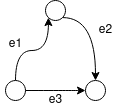
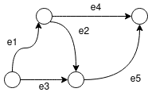
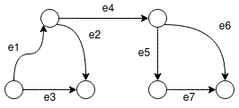

## Матрица инцидентности. Пространство циклов. Аналог разложения Гельмгольца.

Мы выяснили, что матрица инцидентности `B` ориентированного графа -- аналог дифференциального оператора Гамильтона:
 - Если на множестве вершин задана функция (вектор) `f`, то `B*f` -- аналог градиента.
 - Eсли на множестве ребер задана функция (вектор) `g`, то `trans(B) * g` -- аналог дивергенции (мы это не показывали, но это легко проверить, вспомнив физический смысл оперотора дивергенции -- разница между входящим и выходящим потоками).
 - `trans(B) * B` -- оператор Лапласа.
 - Аналог ротора на графах ввести уже проблематично.

 В однои из прошлых серий мы как-то упомянули, что множетсво циклов графа образует в каком-то смысле линейное пространство. Сейчас попробуем разобраться в каком смысле.

 Мы могли бы ввести понятие вектор-цикла как делают почти везде, а потом долго думать над тем, почему эти вектора образуют линейное пространство. Но мы зайдем с другой стороны.

 Пусть на множестве дуг задана функция `f`. В каком случае существует функция `F`, такая что `f = B * F`? 

 В обычном трехмерном случае, с обычным градиентом, это означало бы, что векторное поле `f` является потенциальным. Что работа этого поля вдоль любого замкнутого контура равняется нулю. Ну то есть:

 
 
 
 

А `F` называется потенциалом.

 Для графа, в принципе, все то же самое, только вместо интеграла -- сумма. И нужно правильно определить, что такое `ds`.

Берем цикл -- последовательность дуг: `e1, e2, e3, ... eN`.  И суммируем `f(e1) * s(e1) + f(e2) * s(e2) + ... f(eN) * s(eN)`.
Где `s(ei)` равен 1, если при проходе по циклу, мы идем сонаправлено дуге. И равен  -1, если идем в противоположном направлении.

Пример:

Если мы обходим этот цикл по часовой стрелке, то сумма имеет вид:

`f(e1) + f(e2) - f(e3)`

Если против часовой стрелки:

`-f(e1) - f(e2) + f(e3)`

Теперь можно ввести понятие вектора-цикла:  циклу `C = e1, e2, e3, ... eN` поставим в соответствие вектор длины `|E|`, элементами которого являются значения `s(ei)` и нули для тех дуг, которые в этот цикл не вошли.

Пример:

циклу `e2, e5, e4` будет соответствовать вектор: `[0, 1, 0, -1, 1]`

Если `f` удовлетворяет условию: `f = B*F`, то вышеописанная сумма вдоль любого цикла будет равна нулю. То есть, если `c` -- вектор-цикл, то скалярное произведение `dot(f, c) = 0`. Для любой "потенциальной" `f`. И любого цикла.
И для любой линейной комбинации вектор-циклов. Просто по свойствам скалярного произведения. Именно в этом смысле множество вектор-циклов образуют линейное пространство.

Если бы мы просто начали суммировать циклы и сказали бы, что они образуют линейное пространство, и результатом любой линейной комбинации является цикл, у нас, например, на следующем графе, случился бы занятный казус:

Первый цикл: `e1, e2, e2`

Второй цикл: `e5, e7, e6`

А их сумма -- уже какой-то очень странный цикл. Несвязный.

А с точки зрения суммы значений вдоль цикла все нормально -- ноль и ноль.

----------
Ок. Есть у нас линейное векторное пространство. А какая у него размерность? Какой базис? 

Давайте начнем с размерности.

Для любого элемента `c` нашего пространства циклов верно:

`dot(B*F, c) = 0` при любых `F`!

Это значит, по свойствам скалярного произведения, что пространство циклов (обозначим его `C`) ортогонально образу линейного оператора, задаваемого матрицей `B` (`Image(B)`).

Матрица `B` имеет размеры `|E|x|V|` (предполагаем, что дуг не меньше чем вершин, иначе у нас либо дерево, либо точно несвязный граф и задачу можно разбить). Ее всегда можно добить нулями и говорить, что линейный оператор дейcтвует на векторах размерности `|E|`.

Образ линейного оператора является подпространством линейного пространства. А линейное пространство представляется в виде прямой суммы своего подпространства и пространства ортогонального ему. Короче, `dim(C) = |E| -  dim(Image(B))`. Размерность образа линейного оператора равна рангу его матрицы. 

`dim(C) = |E| - rank(B)`

И это уже почти хорошо. Но можно пойти дальше. Когда мы считали количество остовных деревьев в связном графе, мы выяснили, что в матрице `B` есть ненулевые миноры порядка `|V|-1`. Ненулевых миноров большего порядка в матрице нет так как сумма столбцов в этой матрице всегда дает ноль. А это значит, что для связного графа `rank(B) = |V|-1`

И размерность пространства циклов:

`dim(C) = |E| - |V| + 1`

А что для несвязного графа? В каждой компоненте выполняется полученная формула. Компоненты независимы. Можно показать, что по ним пространство циклов разбивается на ортогональные подпространства. А значит, надо лишь просуммировать и получить:

`dim(C) = |E| - |V| + comp`. Где `comp` -- количество компонент связности.

Отлично, размерность выяснили. Как теперь построить базис?

Строим для связного графа:

 - Берем любое остовное дерево -- на него уйдет `|V|-1` дуг.
 - Останется ровно `|E| - |V| + 1` дуга (размерность пространства!).
 - Если мы будем добавлять любую из оставшихся дуг к нашему дереву, будет образовываться
   ровно один цикл (равносильное определение дерева!)
 - Для каждой из не попавших в дерево дуг выписываем вектор-цикл, получающийся, если ее добавить в дерево
 - Получили `|E| - |V| + 1` вектор. Они и образуют базис (докажите линейную независимость).

 И что нам все это дает? Ну кроме того, что это все очень красиво.

 Еще нам это дает аналог [теоремы Гельмгольца](https://ru.wikipedia.org/wiki/Теорема_разложения_Гельмгольца) о разложении векторного поля, которая нам очень пригодится при анализе потоках в сетях.

 *Для любой функции `f`, заданной на множестве ребер графа, существует (и причем в каком-то смысле единственное) представление вида `f = B*P + F`*
 
 где `P` - аналог потенциала -- функция, заданная на множестве вершин, 
 а для `F`, заданной на множестве ребер, справедливо: `trans(B) * F = 0` то есть "дивергенция" равна нулю: сколько в вершину входит, столько и выходит (в задачах на потоки на графах это называется законом сохранения потока. Или свойством неразрывности потока. Или правилом Кирхгофа).
 
 Убедиться в этом факте очень просто: про вектор `B*P` мы уже знаем, что он лежит в пространстве ортогональном пространству циклов. Осталось проверить, что `F` лежит в пространстве циклов. Если это будет так, то комбинацией таких двух векторов мы сможем получить любой вектор `f`. Причем единственным способом. Неединственность у нас только в выборе потенциала `P`, дающего вектор `B*P`, но подходящих потенциалов -- одномерное (опять-таки рассматриваем случай связного графа) линейное пространство (проверьте!).

Так, проверяем, что `F` пришел к нам из пространства циклов. Считаем скалярное произведение для происзвольного вектора `a`: 

`dot(B*a, F) = dot(a, trans(B)*F) = dot(a, 0) = 0`

Ну все, ортогонален. Такие дела.

Как же здорово, что в нашем дискретном мире графов не надо думать, ни о дифференцируемости, ни о непрерывности, и такие классные аналоги серьезных теорем не требуют наложения дополнительных условий. Любая функция и всё тут. 