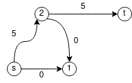
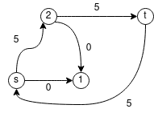

## Матрица инцидентности. Потоки в сетях. Теорема Форда-Фалкерсона

Мы уже получили из матрицы инцидентности кучу аналогов дифференциальных операторов, характеризующих потоки векторных полей.
А в случае графа -- характеризующие потоки на них.

Что вообще такое поток в ориентированном графе (или сети)? Давайте сразу не будем бахать кучу слов про выделенные вершины -- стоки, истоки. А зайдем с другой стороны.

Прежде всего поток, `f`, -- это неотрицательная функция, заданная на дугах графа. Для которой выполняется правило Кирхгофа (сколько в вершину втекает -- столько и вытекает). То есть "дивергенция" `trans(B) * f = 0`. Стоп-стоп, возразят знатоки, но правило Кирхгофа для потока должно выполнятся не для всех вершин... Да, правда. Но нам сейчас будет все равно. Поток `f`, "дивергенция" которого в каждой вершине равна нулю, называется циркуляцией (опять привет пространству циклов!)

А теперь уже давайте назовем какую-то вершину графа`s` -- источником (из этой вершины дуги должны только выходить, иначе не интересно), а какую-то вершину `t` -- стоком (сюда дуги только входят). И вот для всех вершин, кроме `s` и `t`, правило Кирхгофа должно выполнятся. Тогда удовлетворяющая этим требованиям функция `f` -- поток в сети. А значение "дивергенции" в стоке `t`: `(trans(B) * f)[t]` -- называется величиной потока.

Пример (значения возле дуг -- значения `f`)



В вершинах 1 и 2 сумма входящих значений равна сумме выходящих. В вершине `s` "дивергенция" равна -5 (выходит 5). А в вершине `t` -- +5.

Легко проверить и доказать, что для любого потока `(trans(B) * f)[t] + (trans(B)*f)[s] = 0`. То есть, сколько из источника выходит, столько в сток и приходит. По пути никто ничего не ворует и не подкладывает.

А коли так, то чего мы будем думать про эти `s` и `t` отдельно? Бахнем дугу из `t` в `s` -- зациклим поток в нашей сети -- и будем рассматривать только циркуляции. А величину потока будем мерить по значению `F` на какой-то специальной одной единственной дуге. В общем, замыкаем поток и радуемся.



А чего радуемся-то? Так мы ж не просто так же с пространствами циклов разбирались!

`trans(B) * f = 0` -- значит, `f` -- лежит в пространстве циклов нашей замкнутой (дугой из стока в исток) сети.

Упрощаем себе работу: рассматриваем теперь только сети, состоящие целиком из одной компоненты сильной связности. Ну действительно. `s` и `t` должны лежать в одной компоненте сильной связности (из `t` в `s` можно пройти напрямую по добавленой дуге. В обратную сторону тоже должен существовать путь. Иначе только нулевые потоки получатся, а это не интересно). Если какая-то вершина не лежит в той же компоненте -- то единственный способ получить в ней нулевую "дивергеницию" -- нулевой входящий и выходящий поток. Потому что до нее либо не доходит поток из источника, либо из нее поток не добраться до стока.

Теперь у нас все вершины внутри одной компоненты сильной связности. Что нам это дает? А то что можно выбрать набор фундаментальных вектор-циклов (базис в пространстве циклов), такой что все их компоненты будут неотрицательные (поток в противоположную дуге сторону толкать не надо). Более того, можно выбрать этот базис таким, что в каждом вектор-цикле присутствует дуга `(t, s)`

Возьмем такие базисные вектор-циклы `(с1, c2, c3, ...)`, сделаем каждый из них столбцом и соберем матрицу `C`. 

И ясно, что:

`f = C * fs`, где `fs` -- какой-то вектор размерности пространства циклов.

А величина потока равна сумме компонент `fs`, или `dot(fs, 1)`, где `1` -- это вектор из единиц.

------
Теперь можно поговорить о задаче о максимальной потоке. Или же, в нашем случае, о максимальной циркуляции.

На множестве дуг задается положительная функция пропускных способностей `g` (обычно, конечно, используют букву `c` от слова *capacity*, но у нас `c` уже занятя :( ).
Почему положительная? Потому что нулевое значение можно считать отсутствием дуги.

И надо найти поток максимальной величины такой что `f <= g` (покомпонентное сравнение векторов).

Ну что тут, задача [линейного программирования](https://ru.wikipedia.org/wiki/Линейное_программирование):

```
dot(fs, 1) -> max
при условии:
C * fs <= g
C * fs >= 0
```

Так, стоп-стоп, мы же дугу `(t, s)` сами выдумали, какая там пропускнаяю способность-то?! Какая-какая... да любая очень большая! Кстати, это важно.

Что тут можно сделать с этой задачей линейного программирования.
Ну во-первых, мы можем попробовать применить наш выведенный аналог разложение Гельмгольца к `g`:

`g = B*p + C*r`

И если так случайно получится, что `B*p = 0`, то есть вектор пропускных способностей лежит в пространстве циклов, то решать ничего и не надо. Можно положить `f = g`. Или, если граф чудовищно большой для поиска точного решения, а `C*r` оказался положительным (и `B*p` неотрицателен!) и с приемлимым значением на дуге (`t, s`) -- то в качестве приближения можно взять его.

Давайте оценим, на какое вообще значение величины потока мы можем рассчитывать.

Для этого воспользуемя слабым принципом двойственности:

*Значение целевой функции на любом допустимом решении двойственной задачи не меньше, чем значение целевой функции для прямой задачи*

Берем двойственную задачу.

```
dot(g, x) -> min
при условии: 
trans(C)*x - trans(C) * y = 1
x >= 0
y >= 0
или же:
trans(C) * (x - y) = 1
x >= 0
y >= 0
```

И получаем `dot(1, fs) <= dot(d, g)`. Давайте дальше оценивать уже решение двойственной.

Вспоминаем, что дуга `(t,s)` у нас искусственная,
и на ней очень-очень-очень большая пропускная способность. 
Что значит, что при минимизации выражения `dot(g, x)`, компоненту `x` при этой дуге точно надо брать нулевой. 
Да, `x` -- уже функция на дугах.

И тут в игру вступает множество векторов-разрезов -- наборов дуг, делящих сеть на две части.

Возьмем множество вершин графа и разобьем его на две группы. В первую группу обязательно поместим вершину `s`. 
Во вторую -- обязательно помещаем вершину `t`. Остальные раскидываем произвольно.
Берем теперь функцию вершин `h`, заданную так:

```
h[v] = 0, если v в первой группе
h[v] = 1, если v во второй группе
```

Любая функция вершин -- "потенциал". Берем от нее "градиент"

`d = B*h`

`d` -- функция на дугах. Она принимает ненулевые (а именно 1 или -1) значения только на дугах, соединяющих вершины из разных групп.
Такое множество дуг называется разрезом. А `d` -- вектор-разрез.

`d` -- "градиент". А градиент, как мы знаем, не лежит в пространстве циклов. Это значит, что

`trans(C) * d = 0`

А теперь вспоминаем про дугу `(t,s)`. 

`d[(t,s)] = h[s] - h[t] = -1`

Чтобы `d` стала отличным кандидатом для решения двойственной задачи линейного программирования нам надо занулить в ней компоненту, 
соответсвующую дуге `(t,s)`.

Но тогда, по построению `C` (мы требовали, чтоб там всегда была дуга `(t,s)`)

`trans(C) * d = 1`. Для всех `d`, которые можно построить таким образом.

Тогда множество всех решений системы уравнений `trans(C) * z = 1` есть:

`z = d + B * w`

Возьмем для решения двойственной задачи: `x = d` -- от `x` у нас зависит целевая функция.

И `y = B * w` -- а от `y` нет, поэтому пусть он вообще никак не влияет на результат.

Теперь у нас получилась задача:

```
dot(d, g) -> min
при условии:
trans(C) * d = 1
где d >= 0
```

`d` можем быть либо вектором-разрезом. Либо вектором-разрезом с какой-то добавкой `B*w`.
Ограничимся только векторами-разрезами. На них достигается какой-то минимум `min_g` (не обязательно глобальный!).
Этот минимум -- пропускная способность минимального разреза.

Возвращаясь обратно к прямой задаче -- поиску величины максимального потока -- получаем:

`dot(1, fs) <= dot(d, g) <= min_g `

То есть величина максимального потока не превышает пропускной способности минимального разреза.
Ну действительно, пропускная способность любой сети упирается в самое узкое горло -- минимальный разрез.

Но есть такая 
[теорема Форда-Фалкерсона](https://ru.wikipedia.org/wiki/Теорема_Форда_—_Фалкерсона), которая утверждает, что величина максимального потока в точности равна величине минимального разреза!

Доказать этот факт, просто так поигрывая матрицами и скалярными произведениями, проблематично. Нужно рассматривать последовательность разрезов для построения 
пополняющего пути (цикла). 

То есть, если `dot(1, fs) < min_g`, то можно построить вектор-цикл `c0`, уже не обязательно с неотрицательными компонентами. Такой, что найдется число `a > 0`:

`dot(1, fs) + a <= min_g` и `0 <= C*fs + a * c0 <= g`

Рассматривать алгоритм поиска пополняющего пути (цикла) в данной серии заметок не планируется.

-----------
Для построения максимального потока часто используется метод пополняющих путей. Вводится понятние остаточной пропусной способности дуг:
Фактически это две неотрицательные функции дуг: 
- `cforward = g-f` -- остаточная пропускная способность дуги в прямом направлвении.
- `cbackward = f` -- пропускная способность дуги в обратном направлении.

И последовательно ищется **цепь** из `s` в `t` положительной остаточной пропускной способности: для прямого направления дуги берется значение `cforward`, для обратного -- `cbackward`
И вдоль этой цепи поток пополняется.

Фактически, если к таким цепям добавить нашу искусственную дугу `(t,s)`, становится понятно, что метод пополняющих путей последовательно строит
максимальный поток в виде линейной комбинации векторов-циклов. Чем мы, собственно, и занимались.
