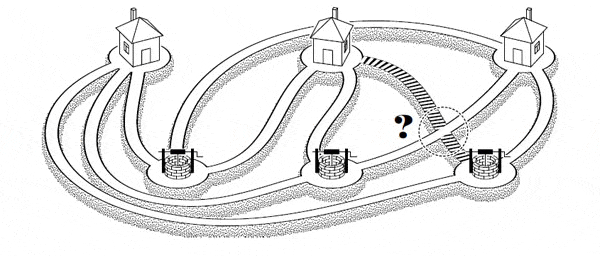

## Матрицы cмежности. Матрица Татта. Паросочетания

Можно ли замостить шахматную доску одинаковыми прямоугольными доминошками? А если какие-то клетки доски будут вырезаны? Если можно, то сколькими способами это можно сделать? Будем разбираться.

На самом деле, конечно, мы не станем заниматься конкретно шахматной доской и доминошками, а будем рассматривать более общий случай.
Клетки шахматной доски -- это вершины некоторого графа. Ребро проводится между смежными клетками. А уложенная доминошка -- выбор ребра. Замощение всей доски -- выбор такого набора ребер, что все множество вершин разбивается на непересекающиеся пары. И вершины внутри такой пары соединены ребром. Паросочетание. Причем, раз покрыто все множество вершин, то паросочетание называется совершенным.

Соответсвенно, уходя от досок и доминошек, нас интересуют вопросы: 

Дан граф
- есть ли в нем совершенное паросочетание?
- сколько различных совершенных паросочетаний на нем есть?

Ясное дело, что для наличия совершенного паросочетания необходимо, чтоб число вершин было четным. 
Так что дальше работаем с:`|V| = 2n`

Граф у нас неориентированный. Ориентируем его просто и тупо: занумеруем вершины, и ребро превращается в дугу от меньшего номера к большему.

Возьмем матрицу смежности `A` нашего графа. Она у нас верхнетреугольная. И размер у нее `2n` на `2n`.

Давайте наобум раскидаем вершины по парам `(i, j)`. (в каждой паре упорядочим вершины: `i` < `j`). Получим `n` каких-то пар. Как проверить, получилось ли у нас паросочетание или нет? Да очень просто:
Перемножим по всем этим парам значения `A[i,j]`. Если между какой-то парой вершин нет ребра -- будет ноль. Если между каждой парой есть ребро -- будет единичка. Осталось только как-то махом проверить все возможные разбиения на пары, и мы получим ответ: есть ли совершенное паросочетание в графе или нет.  

Перебирать все пары -- почти что перебирать все перестановки вершин. Много и долго. Но, раз появляются перестановки, где-то на горизонте начинает маячить определитель матрицы (сумма по всем перестановках же!).

Нам бы просуммировать по всем разбиениям на пары наши произведения `A[i,j]`, и было бы полное счастье... Есть очнь похожая штука! Называется [пфаффиан](https://ru.wikipedia.org/wiki/Пфаффиан). давайте обозначать `Pf(A)`. И у него восхитительное свойство: `det(A) = Pf(A)^2`. Так что мы бы могли посчитать определитель, извлечь квадратный корень и радоваться.

Но, как и для определителя матрицы, вся засада в том, что суммируемые произведения домножаются на знак (четность) перестановки. И вторая засада (но поменьше) -- пфаффиан определяется для кососимметричных матриц. То есть должно быть `trans(A) = -A`. А у нас матрица треугольная.

Давайте воткнем пару костылей и сделаем ее кососиметричной:

Во-первых, давайте вместо единички (если есть дуга) `A[i,j]` будет равно какому-то произвольному числу. Которое будем обозначать `A[i,j]`. Значения для разных дуг друг от друга никак не зависят и могут быть любыми. Получается пока еще треугольная матица `A` каких-то переменных. 

А теперь просто берем и делаем: `A := A - trans(A)`. Все. Кососимметричная. И зовется эта матрица матрицей Татта нашего графа. Эта матрица зависит от `|E|` переменных. 

Если мы посчитаем `det(A)`, то получим многочлен от `|E|` переменных.

Имеет место замечательная теорема:

*`det(A) = 0` (многочлен, тождественно равный нулю) тогда и только того, когда в графе нет совершенного паросочетания.*

Матрица кососимметричная, так что `det(A) = Pf(A)^2`

`Pf(A)` -- это тоже многочлен от `|E|` переменных. Вместо того, чтоб анализировать многочлен `det(A)`, будем разбираться с `Pf(A)` и только им ограничимся. Так можно, потому что в кольце многочленов над вещественными числами нет делителей нуля. 

 `Pf(A)` определяется как сумма по всем возможным "кандидатам в паросочетания". Каждый элемент суммы -- либо ноль (не нашлось какой-то дуги), либо моном -- произведение `n` переменных, соответсвующих ребрам в паросочетании. Причем все мономы различны. Собственно вот и все доказательство теоремы.

----
Теперь очень просто проверить наличие совершенного паросочетания в произвольном графе на `2n` вершинах:
Берем матрицу Татта и считаем определитель.

Но стоп-стоп, это ж многочлен получится, его символьно считать придется, все `(2n)!` перестановок (на всякий случай, у нас `2n` вершин)... Это ж кошмар.

Действительно. Поэтому надо зафиксировать какие-то значения `A[i,j]` и посчитать уже определитель числовой матрицы.

Но стоп-стоп, а вдруг нам не повезет выбрать числа, и определитель получится нулевым, а в графе на самом деле все-таки есть паросочетание?

Нам повезет. Мы выбираем значения для `|E|` переменных. То есть вектор из пространства ` R^|E|`.

Множество корней `det(A)` -- это какая-то поверхность в `R^|E|`. В худшем случае это `|E|-1` параметрическое множество. Короче, у него мера нуль. Просто так случайно в него не попадешь почти наверняка.

И, кстати, извлечь совершенное паросочетания по значению матрицы Татта тоже можно, но это довольно унылое занятие -- алгоримт Рабина-Вазирани: надо посчитать обратную матрицу, найти ненулевой элемент в ней -- ему будет соответствовать ребро из паросочетания. Дальше надо удалить его концы из графа и повторять всю процедуру, пока граф не кончится.

А что если совершенного паросочетания нет, но хочется найти как можно большее? Ну все очень просто: нет совершенного, значит, есть подграф с меньшим числом вершин, в котором совершенное паросочетание есть. Анализируя все возможные подграфы, приходим к выводу, что ранг матрицы Татта как раз равен числу вершин в наибольшем подграфе, имеющем совершенное паросочетание.

-------------

Ну, с наличием паросочетания определились. Может, теперь посчитаем их количество? Просуммируем по всем кандидатам -- посчитаем пфаффиан -- и все ок? Ну опять же, тут засада с тем, что в нем каждое слагаемое домножается на знак перестановки.

А может как-то `A[i,j]` на единички/минус единички позаменять так, чтоб этот дурацкий знак перестановки компенсировать? Найти такую ориентацию, которая бы нам все решила. Действительно, так можно. Такая ориентация дуг, кстати, называется Пфаффовой. И есть даже специальный, довольно сложный, алгоритм [Фишера-Кастеляйна-Темперли](https://en.wikipedia.org/wiki/FKT_algorithm).

Но и тут опять засада -- он работает только для планарных графов. На всякий случай: граф планарен, если его можно нарисовать на плоскости так, чтоб его ребра не пересекались (кроме как в вершинах).

А в общем случае не работает. И вот пример.

Известная задача-подколка: Есть три дома и три колодца, хозяева домов не ладят друг с другом. Каждый хочет ходить к каждому из колодцев. Возможно ли проложить тропинки от домов к колодцам так, чтоб они никогда не пересекались?



Это граф `K(3,3)` -- полный двудольный граф. Он не планарный. Давайте посмотрим на пфаффиан при любом выборе ориентации (1 или -1 писать на дуге) дуг.

Но прямо в лоб его считать довольно уныло. Поэтому чуть схитрим.

Граф двудольный. (еще раз на всякий случай: граф двудолен, если множество его вершин разбивается на два независимых: внутри каждого такого множества вершин нет ни одной дуги). Перенумерацией вершин его матрицу Татта можно привести к виду

```
A = [ 
        0            D
        -trans(D)    O
    ]
```

Матрица `D` имеет размеры `k` на `m`, где `k` -- величина первой доли, а `m` -- величина второй доли.

Матрицу `D` называют матрицей Эдмондса.

Понятное дело, мы рассматриваем случай равных долей (иначе никакого совершенного паросочетания не получится). Так что `D` -- квадратная.

И `Pf(A) = det(D)` С точностью до знака, конечно.

Мы хотим, подбирая ориентацию дуг, добиться того, чтоб значение `Pf(A)` было равно числу совершенных паросочетаний.

Всего свовершенных паросочетаний в `K(3,3)`, очевидно, 6: Проходим по вершинам первой доли: для первой есть 3 варианта, для второй остается 2 варианта, для третьей остается один вариант. 

Считаем пфаффиан:

В случае `K(3,3)`, `D` -- матрица 3 на 3, все элементы которой -- переменные. 

```
D = [
    x1, x2, x3,
    x4, x5, x6,
    x7, x8, x9
]
```

`det(D) = x1*x5*x9 - x1*x6*x8 - x2*x4*x9 + x2*x6*x7 + x3*x4*x8 - x3*x5*x7` 
 
И как тут ни подбирай -1 и 1 для значений `xi`, сделать так, чтоб все 6 слагаемых были с одинаковым знаком, не получится:

Слагаемые с минусом не пересекаются по набору переменных. Чтобы убрать минус в них, нам надо инвертировать знаки в трех переменных. Но тогда и знаки всех положительных слагаемых перевернутся. И мы никуда так не уедем. И шесть единичек не получим.

Занятно, но мешает проворачивать этот фокус с подбором ориентации имеено `K(3,3)`. Для любых графов без `K(3,3)` и подобных ему структур (говорят, что граф свободен от `K(3,3)`) существует Пфаффова ориентация дуг. Но найти ее -- не самая простая задача. Ее мы рассматривать не будем.