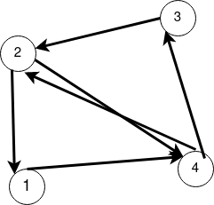
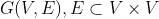

# ГРАФЫ И МАТРИЦЫ
## Введение

В этой серии заметок будут рассмативаться различные манипуляции над графами с минимальным использованием, так сказать, алгоритмического подхода. Никаких обходов, циклов по ребрам, вершинам и блужданий в лабиринтах. Только матрицы. Только алгебра. Только хардкор.

Если кто-то не знает, что такое граф, то сейчас у вас есть замечательная возможность это узнать.

Графом будем называть любую конфигурацию из точек (на плоскости или в пространстве или еще где; будем обозначать кружочками и называть вершинами) и линий (или стрелок!), эти точки соединяющих.

Например, это граф из одной вершины.

А это граф из четырех вершин и трех ребер.
Да, вершины не обязаны быть все соединены. 

Если множество вершин графа разбивается на несколько, не соединенных друг с другом, граф называется несвязным. Граф выше - несвязный.

А вот еще один граф, такой же, как предыдущий, но другой:

Да, у него стрелки. Эти стрелки называются дугами. А нестрелки --- ребрами.
Граф со стрелками -- ориентированый (по дуге можно ходить только в одном направлении) Без стрелок -- неориентированный (ходить по ребру можно в любом направлении). Обычно, рассматривают либо ориентированный, либо неориентированный граф. Хотя в особо запущенных случаях бывают дуги и ребра одновременно.

Последовательность ребер (или дуг, если забить на их направления), соединяющих две какие-то вершины, называют цепью.

Последовательность дуг, если не забивать на их направление, соединяющих две вершины, называют путем.

Если цепь замкнутая (начальная и конечная вершина совпадают), то ее зовут циклом.

Если путь замкнутый, то контуром.

Если вершины в пути/цепи не повторяются (кроме, быть может, начальной и конечной для контуров/циклов), то они зовутся простыми. 

Например,

Контур 1 -> 4 -> 2 -> 1 -- простой

А у пути 1 -> 4 -> 2 -> 4 -> 3 -> 2 все сложно. 

Минимальной терминологии на этом, скорее всего, достаточно. Осталось самое главное: все и почти всегда называют цепи путями, а контуры циклами, и никого это не тревожит. Просто потому что и так ясно из контекста. Если различие явно потребуется, то на это будет отдельно **указано**.

Итак, теперь по умному: определение ориентированного графа *G* без кратных (повторяющихся) дуг!
Это пара множеств *V* и *E*:

*V* -- множество вершин. *E* -- множество упорядоченных пар вершин, то есть дуг.

Если кто помнит, то подмножество декартова произведения иногда зовутся отношениями. Собственно, простейший ориентированный граф задает какое-то бинарное отношение на множестве своих вершин. А бинарные отношения можно задавать матрицами из нулей и единиц! Действительно: занумеровали вершины, поставили по вертикали и горизонтали и айда единицы расставлять там, где есть дуга из одно в другую!
А нули расставлять не будем. Ибо их много, а нам лень.

|   | 1 | 2 | 3 | 4 |
|---|---|---|---|---|
| 1 |   |   |   | 1 |
| 2 | 1 |   |   | 1 |
| 3 |   | 1 |   |   |
| 4 |   | 1 | 1 |   |

Вот эта матрица 4x4 соответствует графу выше.

Первая матрица есть, так что [понеслась](Part1.md)!